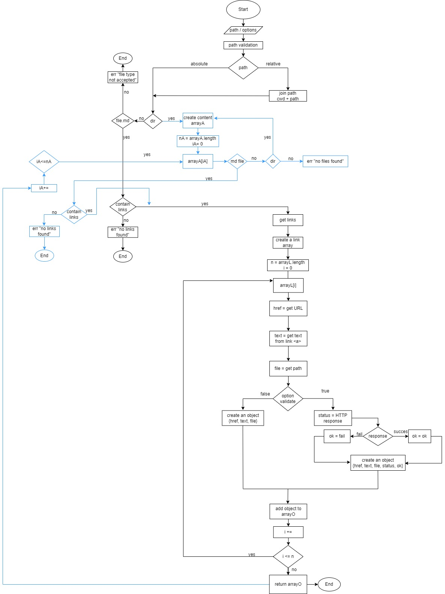
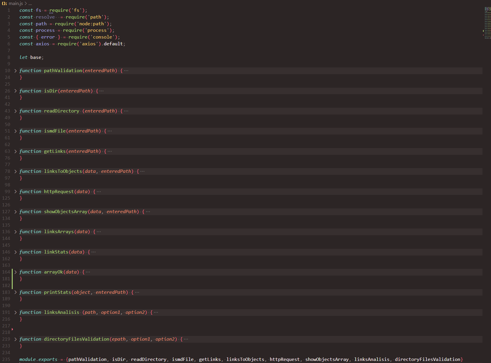
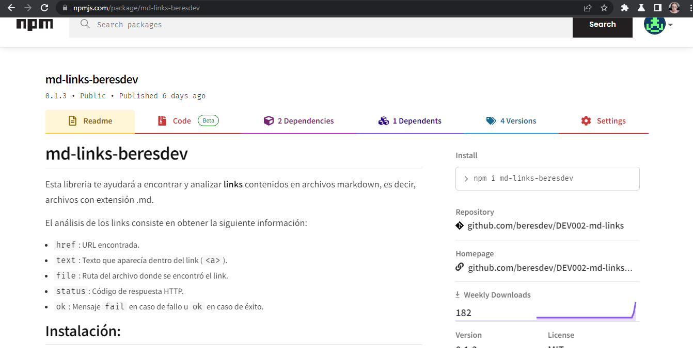

# Creando libreria md-links-beresdev

## 1) JavaScript API

### Diagrama de flujo

Una de las principales actividades que recomendadas para iniciar con la creación de la libreria fue iniciar con un diagrama de flujo que mostrara el camino para resolver el problema, el análisis que realicé resultó en el siguiente diagrama:



## Por partes

### [main.js](./main.js)
Aunque no fue un poryecto sencillo encontré la manera de hacer cada parte del proceso del diagrama anterior una función individual, de tal manera que al final se crearon 15 funciones, las cuales fueron llamadas en alguna parte del flujo.

Todas estas funciones se encuentran en el archivo [main.js](./main.js) y se ven algo así:



### [mdlinks.js](./mdlinks.js)

En este archivo se crea la funcion mdLinks que retorna una promesa. Para cuando la promesa se resuelva se llama a la funcion **directoryFilesValidation()** que hace las primeras validaciones de directorios, usando recursividad.


#### Recursividad

La funcion **directoryFilesValidation()** valida si la ruta igresada/resulta es un directorio, si lo es se vuelve a llamar a sí misma para validar si dentro de ese directorio hay mas directorios para hacer las mismas validaciones. En caso de que la ruta ingresada no sea un directorio pero sea un archivo markdown, llamará a otra función para analizar su contenido. En caso de que no sea ni directorio ni archivo markdown solo arroja un mensaje que nos indica que la ruta es inválida.


### [index.js](./index.js)

En este archivo solo se manda llamar nuestra función **mdLinks()** y la exporta. A su vez, este archivo es nuestro archivo principal o ***main***, paso importante para su publicación de la libreria en npm.  También es nuestro ***binario*** que nos ayuda con la segunda parte del proyecto, hacer el modulo ejecutable mediante la Interfaz de Línea de Comando, para lograr lo anterior, se le agregó al inicio la siguiente línea:

**#!/usr/bin/env node**

En el [package.json](./package.json) se le indicó de la siguiente manera:

  "main": "index.js",

  "bin": "./index.js"

## 2) CLI (Command Line Interface - Interfaz de Línea de Comando)

Como se indico arriba, para la parte del hacer el módulo ejecutable, se hizo la configuración correspondiente en el package.json y en el index.js. 

Para que se reconocieran las opciones ingresadas en CLI se recurrió al proceso de Node process.argv, este proceso se incluyó dentro de [index.js](./index.js).

Adicional, en [mdlinks.js](./mdlinks.js) se le agregaron una serie de validaciones if else para resolver la promesa solo cuando estas opciones coincidieran con las siguientes:

* (option1 === undefined)
* (option1 === "--stats" || option1 === "--validate")&& option2 == undefined)
* (option1 === "--stats" && option2 === "--validate")
* ((option1 != "--stats" || option1 != "--validate")&& option2 == undefined)

Dependiendo de la combinación de estas opciones, dentro de [main.js](./main.js) en la función **linkAnalisis()** se resolvia de la siguiente manera para imprimir los resultados:

```
function linksAnalisis (path, option1, option2) {
    if (option1 === undefined && option2 === undefined) {
        getLinks(path)
            .then(data => linksToObjects(data,path))
            .then(data =>  showObjectsArray(data, path))
            .catch(error => console.log(error));
    } else if(option1 === "--validate" && option2 == undefined){
        return getLinks(path)
                .then(data => linksToObjects(data,path))
                .then(data => httpRequest(data))
                .then(data =>  showObjectsArray(data, path))
                .catch(error => console.log(error));
    } else if(option1 == "--stats" && option2 == undefined) {
        return getLinks(path)
                .then(data => linksToObjects(data,path))
                .then(data => linksArrays(data))
                .then(data => linkStats(data))
                .then(data => printStats(data, path))
    } else if(option1 == "--stats" && option2 == "--validate") {
        return getLinks(path)
                .then(data => linksToObjects(data,path))
                .then(data => httpRequest(data))
                .then(data => arrayOk(data))
                .then(data => printStats(data, path))
    }
}
```
Lo anterior basandose siempre en lo indicado en el [README](https://github.com/Laboratoria/DEV002-md-links) del proyecto.

## 3) md-links-beresdev

Al final la libreria fue publicada en [npm](https://www.npmjs.com/) desde donde puede ser instalada: [md-links-beresdev](https://www.npmjs.com/package/md-links-beresdev)



También puede ser instalada desde GitHub: [md-links-beresdev_github](https://github.com/beresdev/DEV002-md-links.git)
