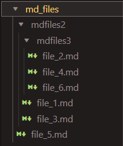

# md-links-beresdev

Esta libreria te ayudará a encontrar y analizar **links** contenidos en archivos markdown, es decir, archivos con extensión .md. 

El análisis de los links consiste en obtener la siguiente información:

* `href`: URL encontrada.
* `text`: Texto que aparecía dentro del link (`<a>`).
* `file`: Ruta del archivo donde se encontró el link.
* `status`: Código de respuesta HTTP.
* `ok`: Mensaje `fail` en caso de fallo u `ok` en caso de éxito.

## Instalación:
Una vez inicializado tu proyecto [npm init](https://docs.npmjs.com/cli/v9/commands/npm-init),

desde tu consola ejecuta:

```
npm i md-links-beresdev
```
o
```
npm install https://github.com/beresdev/DEV002-md-links.git
```


## Importante considerar

Debe ejecutarse de la siguiente
manera a través de la **terminal**:

`md-links-beresdev <path-to-file> [options]`

*path-to-file* puede ser ruta absoluta o relativa, el módulo podrá resolverla en ambos casos.

Se le puede indicar directamente un archivo md o una carpeta. Si la ruta es a un archivo md, lo analizará y en caso de encontrar links imprimirá el resultado de los mismos. Si la ruta señala a una carpeta, el módulo buscará de manera recursiva archivos markdown y los analizará, al final mostrará el despliegue de los archivos encontrados por carpeta y el análisis de los mismos.

Cuando se instala el modulo, por default se carga una carpeta con archivos markdown de ejemplo, dentro de esta se pueden cargar nuevos archivos para ser analizados:



## Modo de ejecución

Por ejemplo:

```sh
$ md-links-beresdev ./md_files/mdfiles2/mdfiles3/file_4.md
Entrando a mdLinks
La ruta ingresada es relativa: ./md_files/mdfiles2/mdfiles3/file_4.md
Ruta resuelta: /home/Proyecto3_Mdlinks/DEV002-md-links/md_files/mdfiles2/mdfiles3/file_4.md
file_4.md es un archivo Markdown
Los links de file_4.md contienen la siguiente información:
[
  {
    href: 'https://jestjs.io/',
    text: 'Jest',
    file: '/home/Proyecto3_Mdlinks/DEV002-md-links/md_files/mdfiles2/mdfiles3/file_4.md'
  }
]
```

El comportamiento por defecto no debe validar si las URLs responden ok o no,
solo debe identificar el archivo markdown (a partir de la ruta que recibe como
argumento), analizar el archivo Markdown e imprimir los links que vaya
encontrando, junto con la ruta del archivo donde aparece y el texto
que hay dentro del link (truncado a 50 caracteres).

### Options

##### `--validate`

Si pasamos la opción `--validate`, el módulo debe hacer una petición HTTP para
averiguar si el link funciona o no. Si el link resulta en una redirección a una
URL que responde ok, entonces consideraremos el link como ok.

Por ejemplo:

```sh
$ md-links-beresdev ./md_files/mdfiles2/mdfiles3/file_4.md --validate
Entrando a mdLinks
La ruta ingresada es relativa: ./md_files/mdfiles2/mdfiles3/file_4.md
Ruta resuelta: /home/Proyecto3_Mdlinks/DEV002-md-links/md_files/mdfiles2/mdfiles3/file_4.md
file_4.md es un archivo Markdown
Los links de file_4.md contienen la siguiente información:
[
  {
    href: 'https://jestjs.io/',
    text: 'Jest',
    file: '/home/Proyecto3_Mdlinks/DEV002-md-links/md_files/mdfiles2/mdfiles3/file_4.md',
    status: 200,
    ok: 'OK'
  }
]
```

Vemos que el _output_ en este caso incluye la palabra `ok` o `fail` después de
la URL, así como el status de la respuesta recibida a la petición HTTP a dicha
URL.

##### `--stats`

Si pasamos la opción `--stats` el output (salida) será un texto con estadísticas
básicas sobre los links.

```sh
$ md-links-beresdev ./md_files/mdfiles2/mdfiles3/file_4.md --stats
Entrando a mdLinks
La ruta ingresada es relativa: ./md_files/mdfiles2/mdfiles3/file_4.md
Ruta resuelta: /home/Proyecto3_Mdlinks/DEV002-md-links/md_files/mdfiles2/mdfiles3/file_4.md
file_4.md es un archivo Markdown
_______________________
stats de: file_4.md
_______________________
{ Total: 1, Unique: 1 }
```

También podemos combinar `--stats` y `--validate` para obtener estadísticas que
necesiten de los resultados de la validación.

```sh
$ md-links-beresdev ./md_files/mdfiles2/mdfiles3/file_4.md --stats --validate
Entrando a mdLinks
La ruta ingresada es relativa: ./md_files/mdfiles2/mdfiles3/file_4.md
Ruta resuelta: /home/Proyecto3_Mdlinks/DEV002-md-links/md_files/mdfiles2/mdfiles3/file_4.md
file_4.md es un archivo Markdown
_______________________
stats de: file_4.md
_______________________
{ Total: 1, Unique: 1, Broken: 0 }
```
